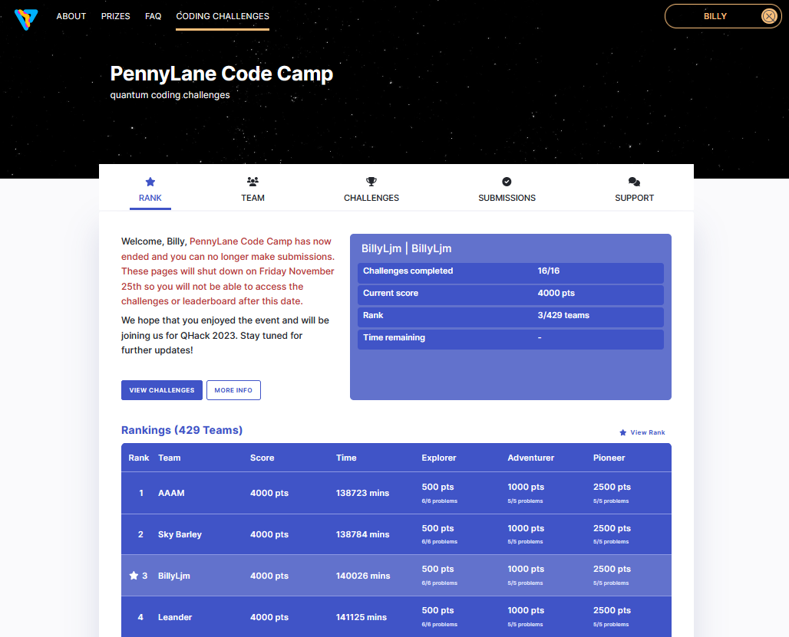
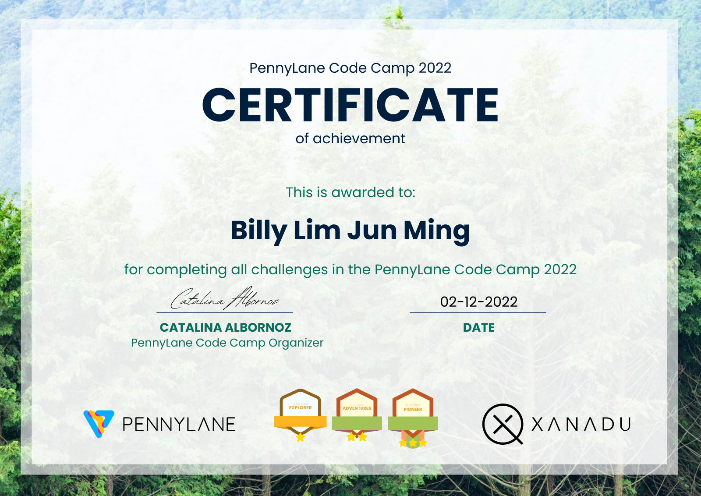

# PennyLane Code Camp (2022)  
These are the challenges I did as part of the [PennyLane Code Camp 2022](https://codecamp.xanadu.ai/)  
  
## Summer School Details  
__Site:__ [Xanadu](https://codecamp.xanadu.ai/)  
__Date:__ November 2022  
  
## Certificate  
Here's a screenshot of my code camp dashboard  
  
  
And here's my certificate for completing all the challenges  
  
  
## Description  
Each challenges is saved in the `ipynb` folder.  
They are also `html` copies in the `html` folder.  